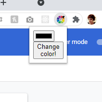
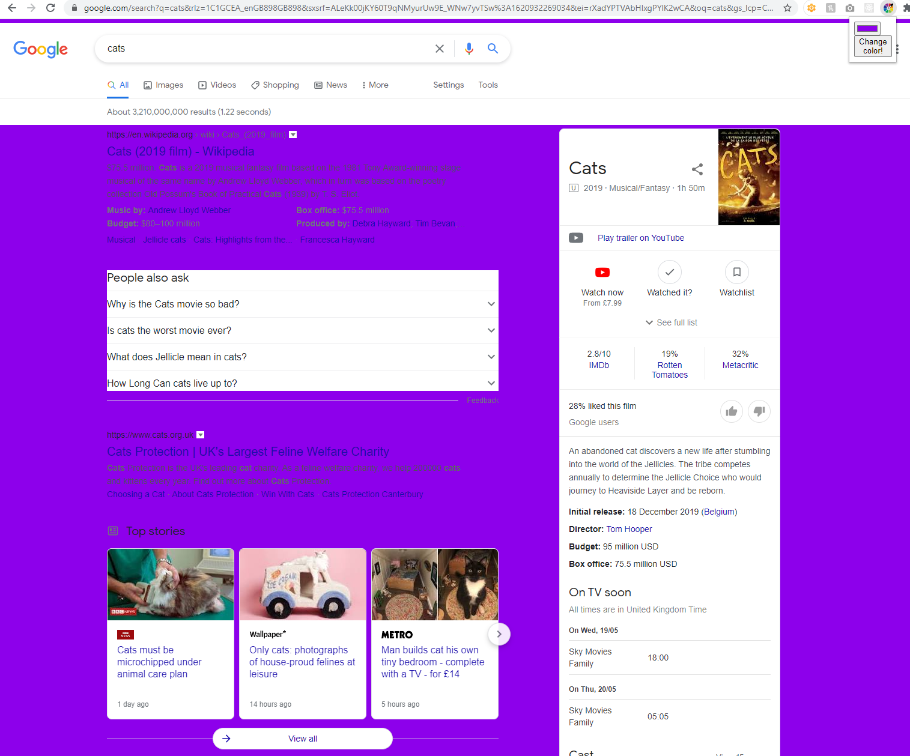

# Color Changer Browser Extension

## How to run

Clone this directory and upload the unpackaged files to your chrome browser in the browser extensions settings.

Go to menu >> Settings >> Extensions and click "Load unpacked". Select the cloned directory to upload the extension.

## What does this extension do?

This extension allows you to change the background color of any website in your active tab.

